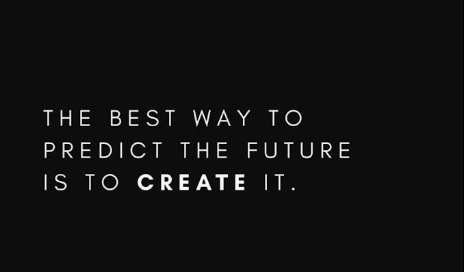

# DataEngineering_ITMD521
Here is my work on Data Engineering. 

# nannadevara

## Where are you from?

Iam from Vizag, South India. Currently living in Aurora, IL.

## IT Interests

Data Analysis using R.

Cloud computing because I started learning AWS cloud practioner course on Udemy and clinet server course now.

Python programming. 

## Something Interesting About You

These are some interesting facts about me:

I completed my bachelor's degree in pharmacy back in India before pursuing a master's degree in information technology.(I switched my career)
I am currently in my fourth semester (final semester) and am very thrilled to study client server now.
It was difficult for me at first (in my first semester) because IT was absolutely new to me. But I put all my hardwork into it, as a result I was able to learn a lot of concepts throughout my master's program at IIT Chicago.

My Proudest moment will be working as a Teaching Assistant for Prof.Yong Zheng's topic ITMD-514 (Programming or data analytics using R) in the fall 2023 semester. Because I came from no IT experience and had no expertise or abilities and being able to secure a TA job on campus really boosted my confidence.

Another interesing fact is that I moved to Chicago after getting married in 2017, took a four-year break, and then started masters. The reason for resuming my career is because I wanted to be self-sufficient and independent. The reason for my career change is that I do not want to remain in the pharmacy industry; instead, I wanted to go to the IT area because there are many job opportunities in the United States. So I accepted it and took it as a challenge and was able to maintain 3.87 GPA.

## What was your first computing device?

My 1st computing device was Desktop computer in my school lab in 10th Grade.

